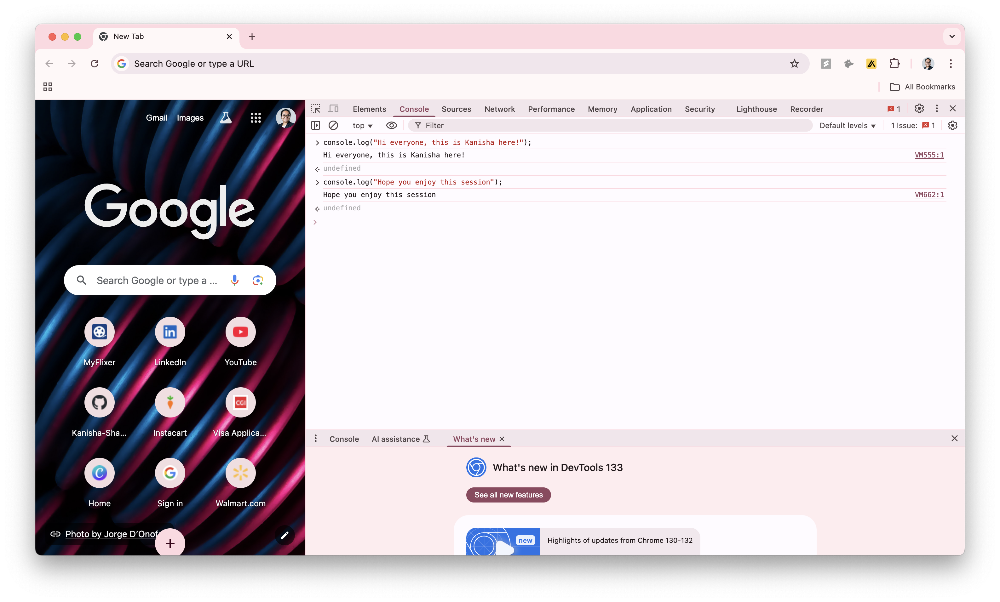
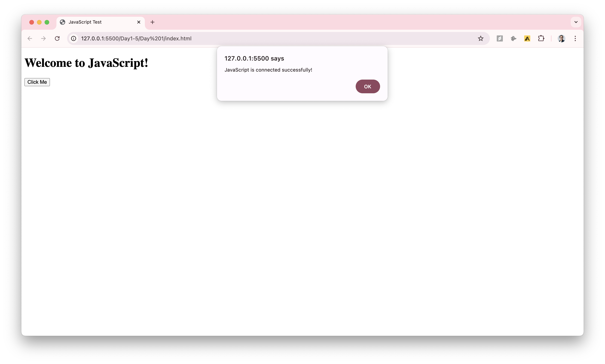
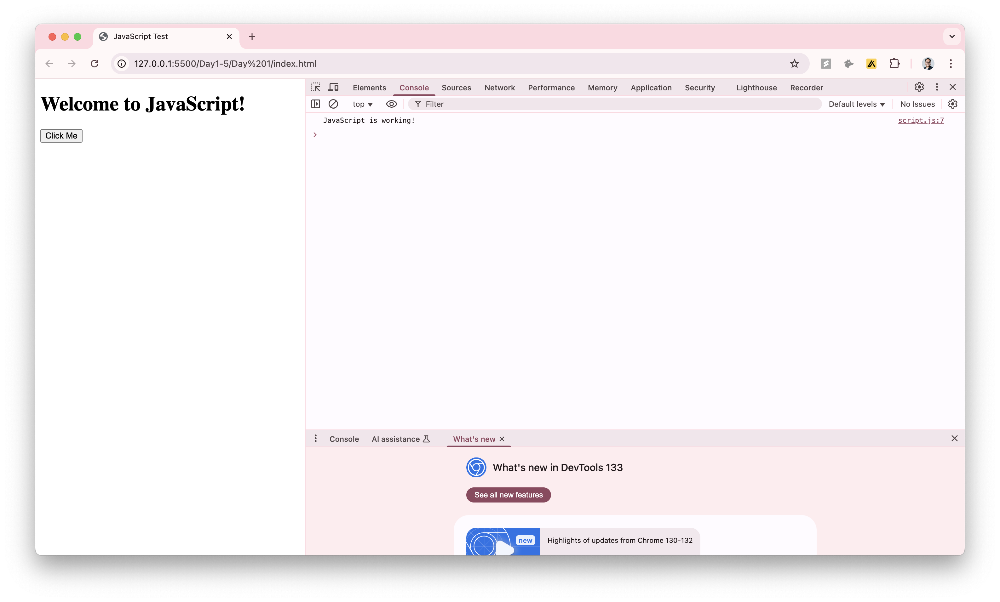

## 💻 Setting Up Your Development Environment

### **1️⃣ Online Practice (No Installation Needed)**
If you don’t want to install anything yet, you can practice JavaScript directly in:
- **Google Chrome DevTools Console** (Right-click → Inspect → Console)

    Refer to **first_day_scripts.js** in the same folder for extra practice & See the magic happen! 🚀.

- **Online Editors** like [JSFiddle](https://jsfiddle.net/), [CodePen](https://codepen.io/), or [Replit](https://replit.com/).

### **2️⃣ Installing VS Code (Recommended)**

To write JavaScript more efficiently, install **VS Code** ([Download Here](https://code.visualstudio.com/)).

After installing, start with -

####  1. Creating a project folder
####  2. Inside the folder, create:
   - **An HTML file** (`index.html`) [ Code available in Folder ]
   - **A JavaScript file** (`script.js`) [ Code available in Folder ]
####  3. Running Your First JavaScript Program:

- Open the HTML file in your VS Code (Right-click → Open with Live Server).

- Click the button → JavaScript Alert should appear! 🎉
- Open the Console (F12 → Console Tab) → You should see "JavaScript is working!" printed.

### 🔥 What’s Next?

Now that we have JavaScript set up, let’s move on to Day 2: Variables & Data Types 🚀.

Don’t forget to check out:

📂 **Hands-on Code (first_day_scripts.js)**

📸 **Screenshots of Output**

📖 **More Learning in Extra_Resources.md**

